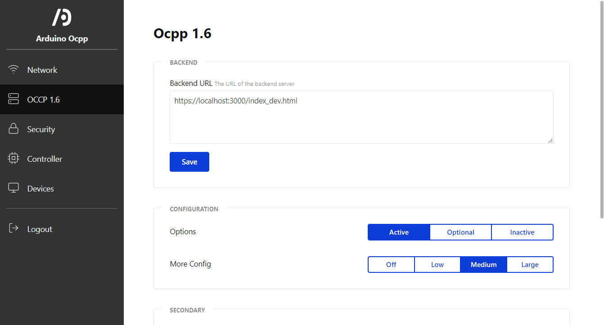

# Dashboard for Arduino OCPP

This is a web-based dashboard for the Arduino OCPP library.

## Purpose and Achitechture

This dashboard is designed to be hosted on a microcontroller. With this requirement in mind some important restrictions have to be acknowledged.
These are:

1. Limited storage space
2. Limited network bandwidth
3. Limited performance on the server side

To overcome these limitations a few key technologies are used in this project for optimal performance.

### Preact

Preact is a Web-UI-Framework that aims to have a particularly small bundle size. The syntax is very closly resembling React, so if you know
React you should feel right at home. But beware, some React features are not implemented and not all libraries are compatible. For
more information see Preact's website: [(https://preactjs.com/)](https://preactjs.com/).

### Compression

The greatest reduction in storage space is achived during the final compression of the project using g-zip. The dashboard
is deployed as a single g-ziped file without dependencies. This also allows a very simple design on the server side. For more information on the compression process see Section [Build the project](#build-the-project).

To be able to bundle everything into a single file all assets (images, external data/text) have to be embedded in the HTML. The [SVGR](https://react-svgr.com/docs/webpack/) library is used to convert SVG images into React components (compatible with Preact). This means that SVG images are treated as components, not assets, in the directory structure. This also means that **no assets should be placed in the public folder and that currently the only supported image type is SVG**.

### Kube CSS

This project uses the KubeCSS library for its default styles. Kube is also designed to have a small bundle size and in my opinion it looks really nice :) Unfortunatly the KubeCSS website is not available anymore, but you can find it on [GitHub](https://github.com/imperavi/kube). To get an overview of supported styles there is a *class_showcase.html* file in the public folder which displays most KubeCSS styles if you visit */class_showcase.html* on the development server. This file will not be bundled in the production build.

## Starting development

To install this project, node.js and npm (node package manager) need to be installed on your machine. You can check if those are installed in your current directory by running the commands:

`node --version`

`npm --version`

Then you should:

1. Clone the repositiory
2. Enter the root directory
3. Run `npm install`
4. Run `npm run dev`

In a short time a development server at http://localhost:3000 should be started.

### API configuration

For development the backend api root is defined in the ".env.development" file. For the production build a file called ".env.production" is used. This file could contain sensible information and is therefore not included in this repository.
The targeted api endpoints are defined in the "constants.js" file in the "src" folder.

## Build the project

1. Enter the root directory of the project
2. Run `npm run build` (Note: The "Css Minimizer plugin" will show a warning since it does not know that css variables exist; it works anyway)
3. Run `npm run compress`
   
Inside the */dist* directory there are now two new files. The *bundle.html* file contains all HTML, CSS and JavaScript required to run the dashboard. You can open it in a browser and the GUI will work just fine. The second file ist the *bundle.html.gz* file. It is the same file as *bundle.html* just gzip-compressed. Therefore it is of a MUCH smaller file size. However, the browser cannot simply open a compressed file. For a browser to open the gzip-compressed file you need to configure it correctly (see "Deploy the project").

## Deploy the project

To deploy the project correctly, your server must serve the *bundle.html.gz* file (you have to build the project first though). This file contains everything that is needed, so you can simply copy it to your server project.

However if you simply send the *bundle.html.gz* file to a client/browser they will not know that it is compressed and nothing will be displayed. So it is very important to add the following http headers to each server response that contains the compressed file:

`Content-Type: text/html`

`Content-Encoding: gzip`